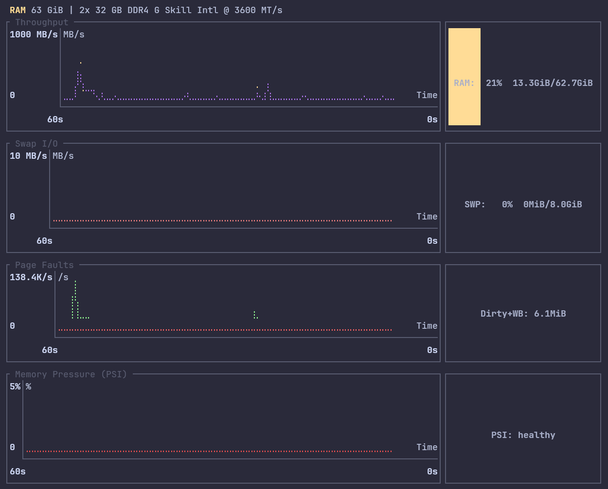
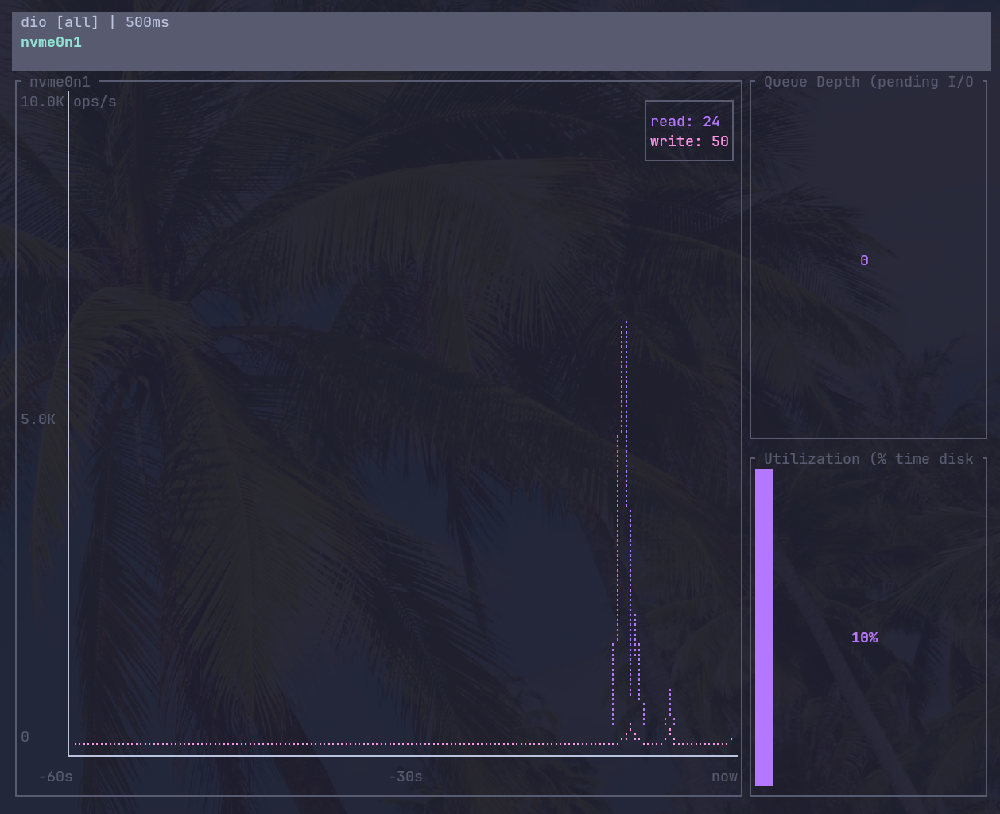

# sysmon

Real-time Linux system monitors with terminal charts. A Cargo workspace containing two tools that share a common charting library.

## ram

Memory monitor: throughput, swap I/O, page faults, and memory pressure (PSI).



```
cargo install --path ram
```

```
ram                           # default 500ms refresh
ram -r 1000                   # 1s refresh
ram -s 120                    # 2 min scrollback
sudo ram --refresh-hardware   # cache DIMM info for header
```

Press `f` for fast mode (25ms/3s), `q` to quit.

## dio

Disk I/O monitor: IOPS and latency per device, with per-process I/O tracking.



```
cargo install --path dio
```

```
dio                  # default 500ms refresh
dio -r 1000          # 1s refresh
dio -a               # include loopback/ram devices
dio -s 600           # 10 minutes of scrollback
```

Press `f` for fast mode, `?` for help, `q` to quit.

## Features (both tools)

- Box-drawing line charts (nvtop-style thin step lines)
- Sticky Y-axis (expands instantly on peaks, contracts after 60s of lower values)
- Fast mode toggle for rapid transient activity
- Configurable refresh rate and scrollback window
- Panic-safe terminal restore

## Security notice: running with sudo

`ram --refresh-hardware` is the **only** reason to run either tool with sudo. When you do, the entire binary runs as root — including all transitive dependencies. See the [ram README](ram/) for detailed security guidance and a manual alternative that avoids sudo entirely.

## Disclaimer

This software was generated with the assistance of AI (Claude, Anthropic). It is provided **as-is**, with **no warranty of any kind**, express or implied, including but not limited to the warranties of merchantability, fitness for a particular purpose, and noninfringement. The author(s) accept **no responsibility or liability** for any damage, data loss, security incidents, or other issues arising from its use, including but not limited to issues caused by running this software with elevated (root/sudo) privileges. Use entirely at your own risk. You are solely responsible for reviewing the code and all dependencies, and for determining their suitability and safety for your environment before running them.

## License

MIT
